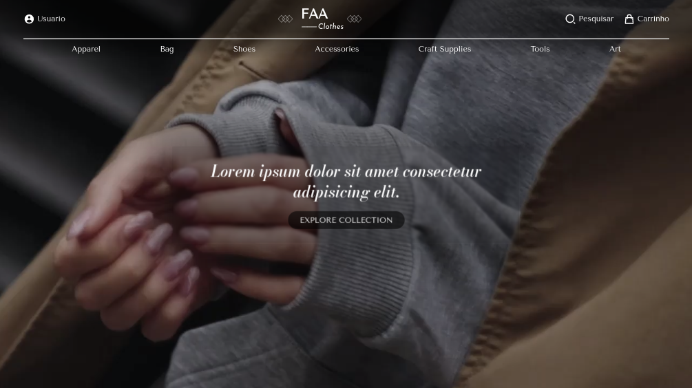

# Flor de açucena 🌸 (In development)

- Acesse: https://flordeacucena.netlify.app/
- Projeto para criação de um e-commerce de roupas feita de tricô e crochê, produzidas por mulheres alagoanas que querem expandir o négocio!

## Screenshots 📷

## Stack utilizada 🧑‍💻

| Front-end               | Back-end                                                |
| ----------------- | ---------------------------------------------------------------- |
|  |  |
|   |  |
|  |  |
|  |  |
|  |  |
|  |  |

## Funcionalidades

- Multiplataforma
- Multidesign
- Animações
- Escalavél

### Funcionalidades em desenvolvimento

- Autenticação de usuário
- Criação da API de produtos/users
- Consumo de API
- Dashboard para ADM
- Formatos de pagamento
- Filtrar/Reorganizar/Pesquisar produtos
## Referência
#### *- Tento fazer sempre meus projetos, respeitando a propriedade intelectual de seus devidos criadores*
### Images(Pexels):  
- [Nguyễn Thanh Ngọc](https://www.pexels.com/pt-br/foto/silhueta-de-mulher-asiatica-atras-de-um-galho-de-arvore-perto-do-oceano-infinito-3995673/)
- [cottonbro studio](https://www.pexels.com/pt-br/foto/homem-de-terno-preto-segurando-um-microfone-4904563/)
- [RODNAE Productions](https://www.pexels.com/pt-br/foto/mulher-de-vestido-azul-e-preto-com-chapeu-marrom-5698985/)
- [Radomir Jordanovic](https://www.pexels.com/pt-br/foto/tres-mulheres-sorrindo-1644888/)
- [Pixabay](https://www.pexels.com/pt-br/foto/retrato-de-mulher-247204/)

### Designs(Figma):  
- [Ali](https://www.figma.com/community/file/1145746569448804794)
- [yeung](https://www.figma.com/community/file/1100683554530273233)
- [Burak](https://www.figma.com/community/file/1174991064846174507)

### Fonts(Google Fonts):  
- [Google Fonts](https://fonts.google.com/)

### Example Video(Youtube):  
- [Cojocaru Pavel](https://www.youtube.com/watch?v=A0ZTru3Xk3E&ab_channel=CojocaruPavel)

## Feedback

Se você tiver algum feedback, por favor nos deixe saber por meio de richardjosephace1960@gmail.com

